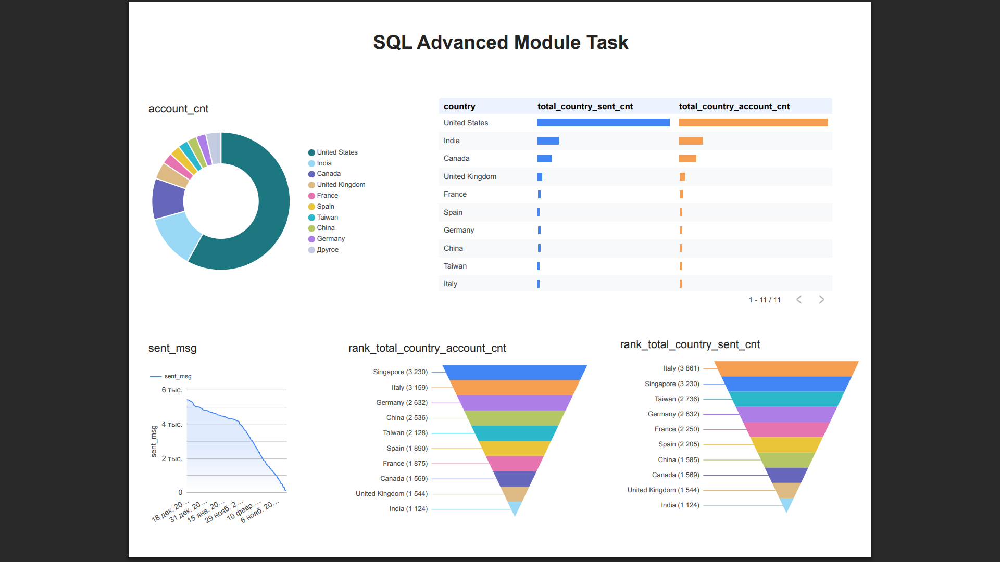

# SQL Portfolio

Тут зібрані мої SQL-запити (BigQuery) з домашніх робіт та фінального завдання модуля по SQL. Кожен запит вирішує окрему задачу з аналізу даних — email-розсилки, акаунти користувачів, виручка по регіонах.

## Що я використовувала в цих запитах

- CTE (WITH) — щоб розбити складний запит на кілька простих кроків
- Віконні функції (SUM OVER, DENSE_RANK) — для підрахунку сум і рангів без втрати рядків
- UNION ALL — щоб об'єднати два різні джерела даних в один запит
- CASE WHEN всередині SUM — для підрахунку по умовах 
- CREATE VIEW — щоб зробити готовий "шар" даних, який можна використати ще раз
- LEFT JOIN — щоб не втратити рядки, у яких немає пари в іншій таблиці

## Файли

  01_top10_countries_accounts_emails.sql
  
  
  02_continent_summary_report.sql
 
  
  03_monthly_account_share_view.sql
  
  
  04_email_funnel_by_os.sql

README.md

## 1. Топ-10 країн за акаунтами та розсилками

**01_top10_countries_accounts_emails.sql**

**Що робить запит:** знаходить топ-10 країн за кількістю акаунтів і топ-10 країн за кількістю відправлених листів. Показує по кожній країні дані по датах, частоті розсилки, верифікації та відписці.

**Висновок:** топ-10 по акаунтах і топ-10 по розсилках — це не завжди одні й ті самі країни. Десь може бути багато акаунтів, але мало листів надсилається, а десь навпаки. Тому у фільтрі стоїть OR — щоб не пропустити жодну "цікаву" країну.

## 2. Звіт по континентах: виручка, акаунти, сесії

**02_continent_summary_report.sql**

**Що робить запит:** збирає в одну таблицю виручку, кількість акаунтів і кількість сесій по кожному континенту.

**Висновок:** тут три різні CTE з'єднуються разом через LEFT JOIN. Так можна побачити, наприклад, континент, де сесій багато, а грошей мало — тобто проблема не в трафіку, а в тому, що люди не купують.

## 3. Частка акаунту в місячній розсилці (VIEW)

**03_monthly_account_share_view.sql**

**Що робить запит:** для кожного акаунту й місяця рахує, скільки відсотків від усіх листів місяця припадає саме на нього, а також дату першого й останнього листа.

**Висновок** запит збережений як VIEW, тобто це вже готовий шматок логіки, який можна викликати будь-коли, не переписуючи запит заново. Якщо в якогось акаунту частка листів раптом дуже висока — це привід перевірити, чи все з ним гаразд.

## 4. Ефективність розсилок по операційних системах
**04_email_funnel_by_os.sql**

**Що робить запит:** рахує, скільки листів відправлено, відкрито і скільки разів перейшли по посиланню — окремо для кожної операційної системи. Враховує тільки тих, хто не відписався.

**Висновок** окрім Open Rate і Click Rate тут ще є CTOR  — відсоток переходів саме серед тих, хто вже відкрив лист. Якщо Open Rate низький — проблема в темі листа. Якщо CTOR низький — проблема вже в самому вмісті листа.
